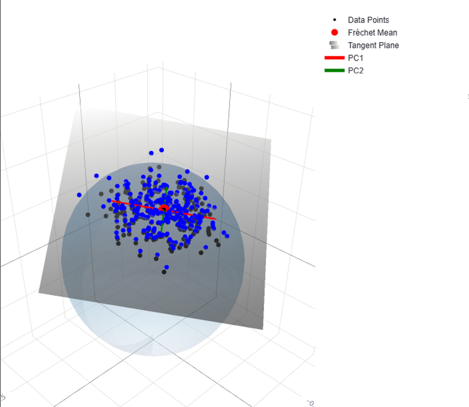

## Screenshot

Data generated on a 2D spherical manifold under the von Mises distribution. It shows the tangent plane at the Fréchet mean and the projection via the log map and PCA, highlighting the principal axis of variation. The data is then projected back using the exp map to preserve the geometry.

